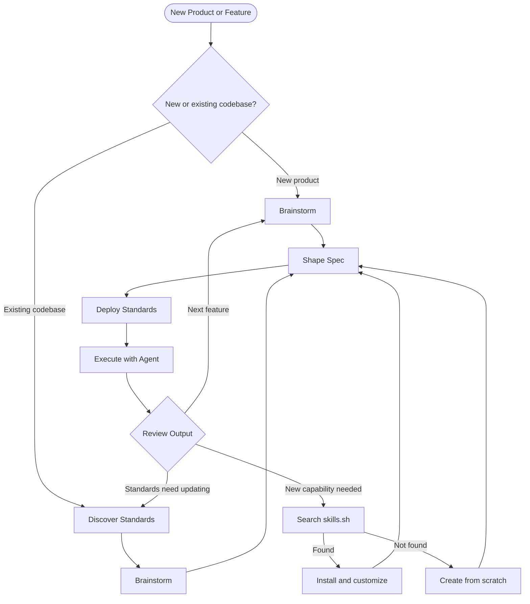

# Blueprint OS

A portable, tool-agnostic AI agent workflow system built on skills and standards. Works in Cursor, Antigravity, Claude Code, or any AI IDE.

---

## What is Blueprint OS?

Every time you start a new session with an AI agent, you re-teach it your context — your conventions, your architecture, your preferences. Blueprint OS eliminates that friction.

It gives your AI agent a persistent operating system:

- **Skills** — reusable instruction sets the agent follows for specific tasks
- **Standards** — documented patterns extracted from your codebase
- **Specs** — structured plans shaped before execution

Since everything is plain markdown, it works with any tool that can read files.

---

## Workflow



### The Core Loop

| Step | What happens | Skill |
|---|---|---|
| 1. Plan Product | Document your mission, stack, and roadmap | *(manual)* |
| 2. Discover Standards | Extract patterns from your codebase into `standards/` files | `discovering-standards` |
| 3. Brainstorm | Explore the problem, compare approaches, produce a design document | `brainstorming` |
| 4. Shape Spec | Formalize the chosen direction into an implementation spec | `shaping-specs` |
| 5. Deploy Standards | Inject relevant standards into the agent's context | `deploying-standards` |
| 6. Execute | Run the agent with full context | *(your agent)* |
| 7. Review & Refine | Update standards as patterns evolve | repeat |

---

## Quick Start

### 1. Copy Blueprint OS into your project

Place the `.agent/` folder and `standards/` folder at the root of your project:

```
your-project/
├── .agent/
│   └── skills/
├── standards/
└── ... your code
```

### 2. Choose your tool

| Tool | Setup | Guide |
|---|---|---|
| Cursor | Reference SKILL.md files via `.cursor/rules/` | [adapters/cursor.md](adapters/cursor.md) |
| Antigravity | Native — `.agent/skills/` is the default path | [adapters/antigravity.md](adapters/antigravity.md) |
| Claude Code | Use slash commands or `@file` references | [adapters/claude-code.md](adapters/claude-code.md) |
| skills.sh | Install community skills with `npx skills add` | [adapters/skills-sh.md](adapters/skills-sh.md) |
| Any other AI | Paste or reference `SKILL.md` content directly | Read the skill file and include it in your prompt |

### 3. Run your first workflow

**Starting a new product (no codebase yet):**

```
1. Ask your agent: "Read .agent/skills/brainstorming/SKILL.md and brainstorm [product idea]"
2. Ask your agent: "Read .agent/skills/shaping-specs/SKILL.md and shape a spec using specs/brainstorm-<name>.md"
3. Ask your agent: "Read .agent/skills/deploying-standards/SKILL.md and inject relevant standards for [task]"
```

**Starting a new feature in an existing codebase:**

```
1. Ask your agent: "Read .agent/skills/discovering-standards/SKILL.md and document my codebase standards"
2. Ask your agent: "Read .agent/skills/brainstorming/SKILL.md and brainstorm [feature] with the existing standards loaded"
3. Ask your agent: "Read .agent/skills/shaping-specs/SKILL.md and shape a spec using specs/brainstorm-<name>.md"
4. Ask your agent: "Read .agent/skills/deploying-standards/SKILL.md and inject relevant standards for [task]"
```

**Adding a new skill:**

```
1. Browse https://skills.sh or run: npx skills add find-skills
2. If found: npx skills add <owner/repo>
3. If not found: ask your agent "Read .agent/skills/creating-skills/SKILL.md and create a skill for [task]"
```

---

## Skills Index

Skills live in `.agent/skills/`. Each skill is a `SKILL.md` file the agent reads and follows.

| Skill | Path | Purpose |
|---|---|---|
| Brainstorming | `.agent/skills/brainstorming/` | Explore problems, compare approaches, produce a design document |
| Creating Skills | `.agent/skills/creating-skills/` | Find on skills.sh first, author from scratch as fallback |
| Shaping Specs | `.agent/skills/shaping-specs/` | Formalize a chosen direction into an implementation spec |
| Discovering Standards | `.agent/skills/discovering-standards/` | Extract codebase patterns into standards files |
| Deploying Standards | `.agent/skills/deploying-standards/` | Inject relevant standards into agent context |

**Community skills** from [skills.sh](https://skills.sh) install directly into `.agent/skills/` and work with Blueprint OS out of the box. Run `npx skills add <owner/repo>` to install any skill from the registry.

---

## When to brainstorm vs. shape a spec

These two skills are sequential, not interchangeable.

| Situation | Start with |
|---|---|
| You know what to build and how | `shaping-specs` directly |
| You know what to build but not how | `brainstorming` first |
| You have a rough idea but it's unclear | `brainstorming` first |
| New product, no codebase yet | `brainstorming` first |
| New feature in a legacy codebase | `discovering-standards` → `brainstorming` → `shaping-specs` |
| Bug fix or small task | `shaping-specs` or skip to `deploying-standards` |

**Brainstorming produces a design document** (`specs/brainstorm-<name>.md`). Spec shaping picks that up and formalizes it into an implementation spec (`specs/<feature-name>.md`). They're two steps in the same pipeline, not alternatives.

---

## Project Structure

```
blueprint-os/
├── README.md
├── .agent/
│   └── skills/
│       ├── brainstorming/
│       │   └── SKILL.md
│       ├── creating-skills/
│       │   └── SKILL.md
│       ├── shaping-specs/
│       │   └── SKILL.md
│       ├── discovering-standards/
│       │   └── SKILL.md
│       └── deploying-standards/
│           └── SKILL.md
├── specs/
│   └── (brainstorm docs and specs saved here)
├── standards/
│   └── README.md
└── adapters/
    ├── cursor.md
    ├── antigravity.md
    ├── claude-code.md
    └── skills-sh.md
```

---

## Skill Format

Every `SKILL.md` is self-contained and follows this universal structure:

```markdown
---
name: gerund-skill-name
description: Third-person description with specific triggers. Max 1024 chars.
---

# Skill Title

## When to use this skill
- Trigger condition 1
- Trigger condition 2

## Workflow
- [ ] Step 1
- [ ] Step 2

## Instructions
Specific logic, rules, and code examples.

## Resources
- Links to supporting files
```

This format is compatible with Antigravity natively. For other tools, see the [adapters/](adapters/) folder.

---

## Standards

Standards live in `standards/`. They are plain markdown files documenting the patterns, conventions, and architecture decisions of your specific project. See [standards/README.md](standards/README.md) for the format and conventions.

---

## Philosophy

- **Portable** — plain markdown files, no vendor lock-in
- **Composable** — skills are independent and combinable
- **Iterative** — standards evolve with your codebase
- **AI-first** — written for agents to read and follow, not for humans to memorize
# blueprint-os
